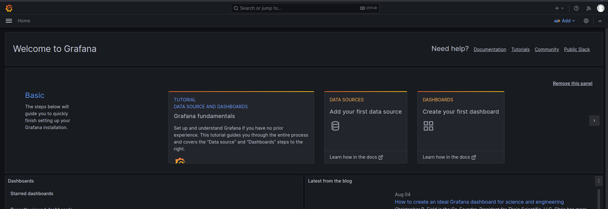
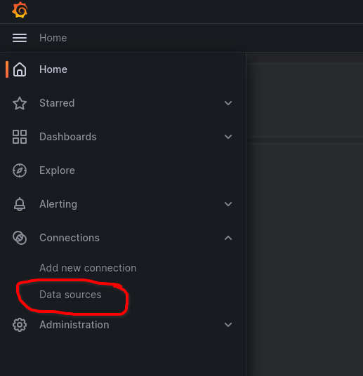
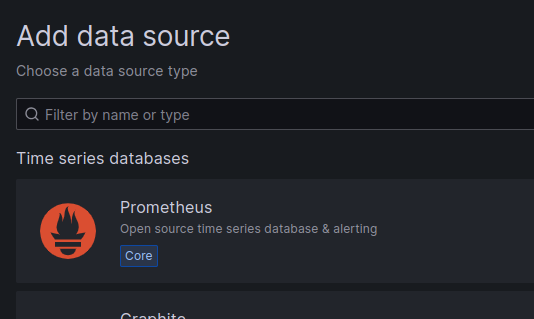
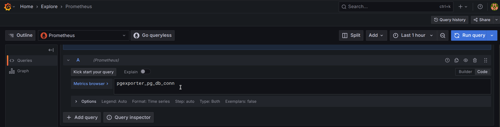
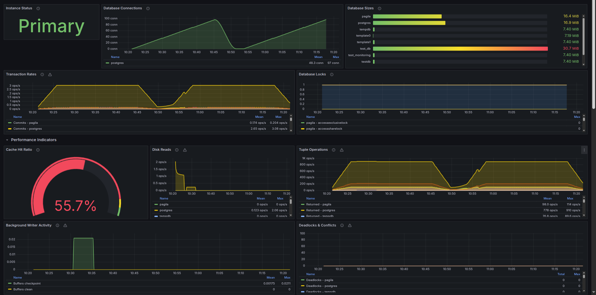

\newpage

# Grafana Dashboard

## Prometheus Configuration

### Installation
First of all, you should install Prometheus in your pgexporter server. Download one of the binaries from the [Prometheus Downloads](https://prometheus.io/download/), say `prometheus-3.1.0.linux-amd64.tar.gz` (may be different for you, but the following instructions are based off of this).

Unzip the tarball:
```sh
$ tar -xzvf prometheus-3.1.0.linux-amd64.tar.gz
```

(OPTIONAL) Putting the binaries in a location included in `PATH` so that it's convenient to use `$ prometheus` (choosing `/usr/local/bin` for this):
```sh
$ sudo mv prometheus-3.1.0.linux-amd64/prometheus /usr/local/bin
$ sudo mv prometheus-3.1.0.linux-amd64/promtool /usr/local/bin
```

### Configuration

After you successfully installed Prometheus, you should replace `prometheus.yml` with the content below to configure how to query your pgexporter metrics (assuming `pgexporter` runs on port `5002` on `localhost`):
```yml
scrape_configs:
  - job_name: 'pgexporter'
    metrics_path: '/metrics'
    static_configs:
      - targets: ['localhost:5002']
```

Run Prometheus using:
```sh
$ prometheus
```
(assuming there is a valid `./prometheus.yaml`).


Then the Prometheus service will query your pgexporter metrics every 15 seconds and package them as time-series data. You can query your pgexporter metrics and watch their changes as time passed in Prometheus web page (default port is `9090`).


## Grafana Dashboard

Although Prometheus provides capacity of querying and monitoring metrics, we can not customize graphs for each metric and provide a unified view. As a result, we use Grafana to help us manage all graphs together, we also provide dashboards which can be imported to Grafana.

### Installation

First of all, we should install Grafana in the computer you need to monitor pgexporter metrics. Installation instructions for your preferred operating system is provided in the official [Grafana Installation page](https://grafana.com/docs/grafana/latest/setup-grafana/installation/):

For example, on Fedora it is:
```sh
$ wget -q -O gpg.key https://rpm.grafana.com/gpg.key
$ sudo rpm --import gpg.key
```

Create and edit file `grafana.repo`:
```sh
$ sudo nano /etc/yum.repos.d/grafana.repo
```
Contents of the file:
```
[grafana]
name=grafana
baseurl=https://rpm.grafana.com
repo_gpgcheck=1
enabled=1
gpgcheck=1
gpgkey=https://rpm.grafana.com/gpg.key
sslverify=1
sslcacert=/etc/pki/tls/certs/ca-bundle.crt
```
Save and Exit.

```sh
$ sudo dnf install grafana
```

Start the daemon:
```sh
$ sudo systemctl start grafana-server
$ sudo systemctl status grafana-server
```
Verify the status is "active (running)".

#### Configuration
You can now browse Grafana web page with default port `3000`, default user `admin` and default password `admin`.


Set the new password.



Then you can create Prometheus data source of pgexporter. Click Menu -> Connections -> Data Sources -> "Add data source" -> Prometheus.






Then configure the data source and then "Save & test":


Then you can explore dashboards with queries in "Expore" (Home -> Explore):



Then "Run Query":


### Importing pgexporter dashboard

You could also use pgexporter dashboards which are available in [contrib/grafana](../../contrib/grafana/) directory. Navigate to Click Home -> Dashboards -> New Dashboard and import a new dashboard.


Select "Upload dashboard as JSON file", next select a JSON file based on your Postgres version from [contrib/grafana](../../contrib/grafana/) directory and finally click on "Import".

You will now be able to view important metrics which pgexporter provides.



Based on your Postgres version you will be able to see sections related to
#### System Health
Instance Status (Primary/Replica indicator), Database Connections, Database Sizes, Transaction Rates, Database Locks

#### Performance Indicators
Cache Hit Ratio, Disk Reads, Tuple Operations (Select, Insert, Update, Delete), Background Writer Activity, Deadlocks & Conflicts

#### WAL & Replication
WAL Generation, Replication Status, WAL Archiving, Database Age (Transaction ID Wraparound)

#### Query Analysis
Most Executed Queries, Slowest Queries, Highest WAL Usage Queries, Index Usage

#### Advanced Metrics
I/O Operations by Backend Type , Memory Usage by Context , Wait Events Statistics , Session Workload Statistics , Logical Replication Statistics.