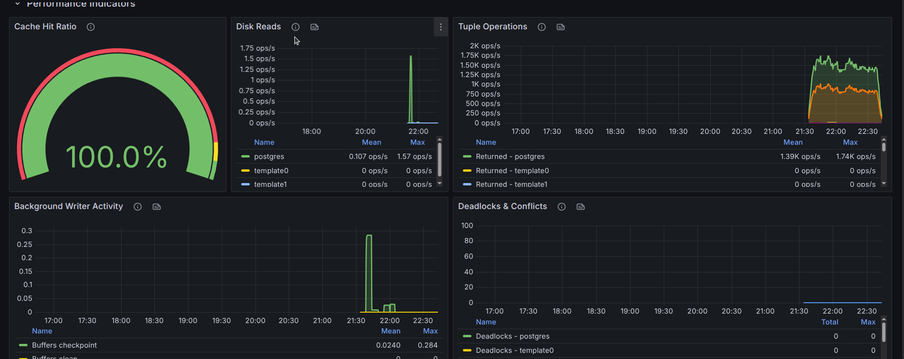
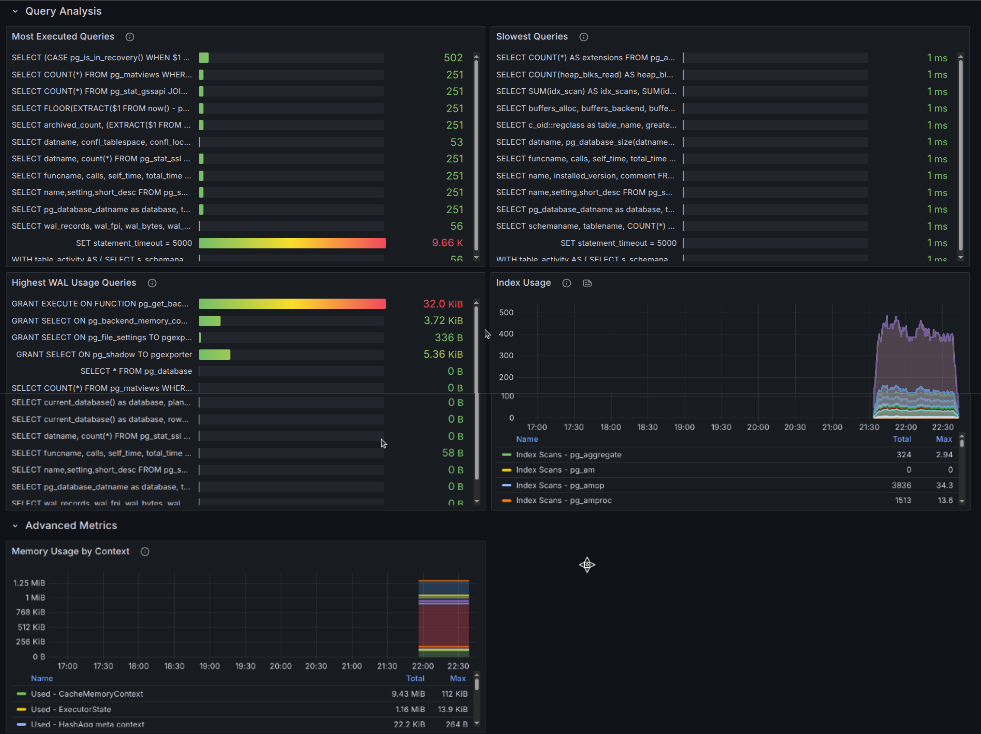
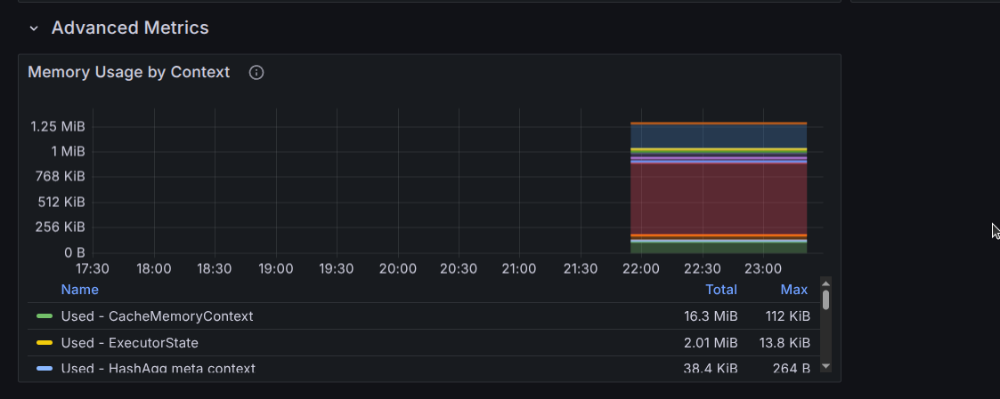
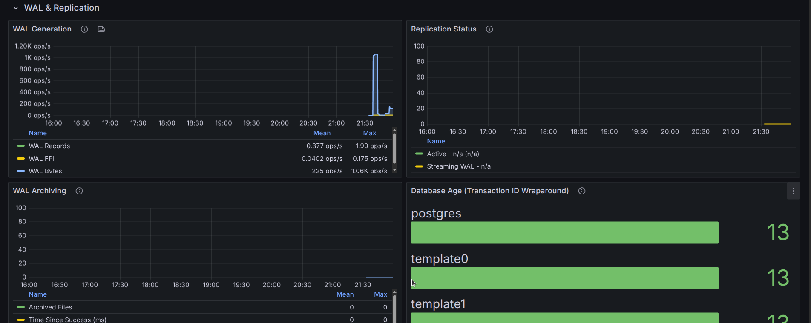

\newpage

# Grafana Dashboard

## Prometheus Configuration

### Installation
First of all, you should install Prometheus in your pgexporter server. Download one of the binaries from the [Prometheus Downloads](https://prometheus.io/download/), say `prometheus-3.5.0.linux-amd64.tar.gz` (may be different for you, but the following instructions are based off of this).

Unzip the tarball:
```sh
$ tar -xzvf prometheus-3.5.0.linux-amd64.tar.gz
```

(OPTIONAL) Putting the binaries in a location included in `PATH` so that it's convenient to use `$ prometheus` (choosing `/usr/local/bin` for this):
```sh
$ sudo mv prometheus-3.5.0.linux-amd64/prometheus /usr/local/bin
$ sudo mv prometheus-3.5.0.linux-amd64/promtool /usr/local/bin
```

### Configuration

After you successfully installed Prometheus, you should replace `prometheus.yml` with the content below to configure how to query your pgexporter metrics (assuming `pgexporter` runs on port `5002` on `localhost`):
```yml
scrape_configs:
  - job_name: 'pgexporter'
    metrics_path: '/metrics'
    static_configs:
      - targets: ['localhost:5002']
```

Run Prometheus using:
```sh
$ prometheus
```
(assuming there is a valid `./prometheus.yaml`).


Then the Prometheus service will query your pgexporter metrics every 15 seconds and package them as time-series data. You can query your pgexporter metrics and watch their changes as time passed in Prometheus web page (default port is `9090`).


## Grafana Dashboard

Although Prometheus provides capacity of querying and monitoring metrics, we can not customize graphs for each metric and provide a unified view. As a result, we use Grafana to help us manage all graphs together.

### Quick Start (Docker Compose)

For a complete, pre-configured environment, we recommended using the Docker Compose setup provided in `contrib/grafana`. This automatically starts Grafana 12+ and Prometheus, and provisions all dashboards.

1.  Navigate to the directory:
    ```sh
    $ cd contrib/grafana
    ```

2.  Start the stack:
    ```sh
    $ docker compose up -d
    ```

3.  Access Grafana at `http://localhost:3000` (User: `admin`, Password: `admin`).

#### All dashboards are automatically provisioned, so no manual import is needed.

### Installation (Manual)

First of all, we should install Grafana in the computer you need to monitor pgexporter metrics. Installation instructions for your preferred operating system is provided in the official [Grafana Installation page](https://grafana.com/docs/grafana/latest/setup-grafana/installation/):

For example, on Fedora it is:
```sh
$ wget -q -O gpg.key https://rpm.grafana.com/gpg.key
$ sudo rpm --import gpg.key
```

Create and edit file `grafana.repo`:
```sh
$ sudo nano /etc/yum.repos.d/grafana.repo
```
Contents of the file:
```
[grafana]
name=grafana
baseurl=https://rpm.grafana.com
repo_gpgcheck=1
enabled=1
gpgcheck=1
gpgkey=https://rpm.grafana.com/gpg.key
sslverify=1
sslcacert=/etc/pki/tls/certs/ca-bundle.crt
```
Save and Exit.

```sh
$ sudo dnf install grafana
```

Start the daemon:
```sh
$ sudo systemctl start grafana-server
$ sudo systemctl status grafana-server
```
Verify the status is "active (running)".

#### Configuration
You can now browse Grafana web page with default port `3000`, default user `admin` and default password `admin`.


Set the new password.


Then you can create Prometheus data source of pgexporter. Click Menu -> Connections -> Data Sources -> "Add data source" -> Prometheus.


Then configure the data source and then "Save & test":


Then you can explore dashboards with queries in "Expore" (Home -> Explore):


Then "Run Query":


### Importing pgexporter dashboard

You could also use pgexporter dashboards which are available in [contrib/grafana](../../../contrib/grafana/) directory. Navigate to **Home -> Dashboards -> New -> Import**.


We provide 6 version-specific dashboards to support the unique features of each PostgreSQL version:

*   `postgresql_dashboard_pg13.json`
*   `postgresql_dashboard_pg14.json` (+ Memory Contexts)
*   `postgresql_dashboard_pg15.json` (+ Memory Contexts)
*   `postgresql_dashboard_pg16.json` (+ pg_stat_io)
*   `postgresql_dashboard_pg17.json` (+ Wait Events)
*   `postgresql_dashboard_pg18.json` (+ Wait Events)

Select **"Upload dashboard as JSON file"**, choose the file matching your PostgreSQL version from the [contrib/grafana](../../../contrib/grafana/) directory, select your Prometheus datasource, and click **"Import"**.

You will now be able to view important metrics which pgexporter provides.


The dashboard organizes metrics into logical sections:

#### System Health
Instance Status (Primary/Replica), Database Connections, Database Sizes, Transaction Rates, Database Locks.


#### Performance Indicators
Cache Hit Ratio, Disk Reads, Tuple Operations (Select/Insert/Update/Delete), Background Writer Activity, Deadlocks & Conflicts.



#### Query Analysis
Most Executed Queries, Slowest Queries, Highest WAL Usage Queries, Index Usage (requires `pg_stat_statements`).



#### Memory & I/O (Version Dependent)
*   **PG14+**: Memory Usage by Context (Used/Free/Total)
*   **PG16+**: Detailed I/O statistics (Reads/Writes/Extends per backend type)
*   **PG17+**: Wait Events analysis (Pie chart breakdown by type)




#### WAL & Replication
WAL Generation, Replication Status, WAL Archiving, Transaction ID Wraparound (Database Age).



### Switching Datasources

If you have configured multiple Prometheus datasources (e.g., for different PostgreSQL servers), you can easily switch between them using the datasource dropdown at the top of the dashboard.


Select the desired datasource from the dropdown to view metrics from that specific server.

## Alerting with Grafana

In addition to dashboards, Grafana can monitor pgexporter metrics and send notifications when something goes wrong — for example, when PostgreSQL goes down, connections are running out, or replication is falling behind.

### Setting Up a Contact Point

Before creating alerts, you need to configure where notifications are sent. We use Slack as an example here, but Grafana also supports Email, PagerDuty, Microsoft Teams, and others (see the [Grafana Contact Points documentation](https://grafana.com/docs/grafana/latest/alerting/fundamentals/notifications/contact-points/)).

First, create a Slack Incoming Webhook for the channel you want to receive alerts in (Slack -> Apps -> Incoming Webhooks -> Add New Webhook) (see the [Slack Incoming Webhooks documentation](https://docs.slack.dev/messaging/sending-messages-using-incoming-webhooks/)).

Then in Grafana, click Alerts & IRM -> Contact points -> "Create contact point".

**Click on "Contact points".**


**Click on "Create contact point".**


**Set contact point**

Set the name (e.g., `pgexporter-slack`), choose "Slack" as the integration type, and paste your Webhook URL. Click "Test" to verify the connection, then "Save contact point".


**Successful connection**


### Creating an Alert Rule

We will create a `PostgreSQLDown` alert as an example. This alert fires when a PostgreSQL server monitored by pgexporter becomes unreachable.

Click Alerts & IRM -> Alert rules -> "+ New alert rule".

Enter the rule name `PostgreSQLDown`.

Then define the query and condition. Select your Prometheus datasource (the one scraping pgexporter) and enter the following query:
```promql
pgexporter_postgresql_active == 0
```

Set the condition to fire when the query result is above `0` (i.e., at least one server is down). Click "Preview" to verify the expression.

Then set the folder and labels. Choose or create a folder (e.g., `pgexporter-alerts`) and add labels such as `severity = critical`.


Next, configure the evaluation behavior. Select or create an evaluation group (e.g., `pgexporter` with interval `1m`). Set the pending period to `1m` — this means the condition must be true for 1 minute before the alert fires, which avoids false alarms from brief scrape gaps.


Then configure the notifications. Select the contact point you created earlier (e.g., `pgexporter-slack`).


You can also add annotations to include useful information in the notification message:

*   **Summary**: `PostgreSQL server {{ $labels.server }} is down`
*   **Description**: `The PostgreSQL instance {{ $labels.server }} has been unreachable for more than 1 minute.`


Click "Save rule and exit".


Verify that the new rule appears in the Grafana Managed Alert Rules list.


You can repeat these steps for additional alerts. The following section lists recommended alerts you can create using pgexporter's existing metrics.

### Recommended Alerts

The following alerts cover the most critical conditions for PostgreSQL monitoring. For each alert, use the same steps described above — only the rule name, query, severity label, and pending period change.

#### Availability

| Alert Name | Severity | PromQL Expression | Pending Period |
|------------|----------|-------------------|----------------|
| `PgExporterDown` | critical | `pgexporter_state == 0` | 1m |
| `PostgreSQLDown` | critical | `pgexporter_postgresql_active == 0` | 1m |

#### Replication

| Alert Name | Severity | PromQL Expression | Pending Period |
|------------|----------|-------------------|----------------|
| `PostgreSQLReplicationLagCritical` | critical | `pgexporter_pg_wal_last_received > 300000` | 2m |
| `PostgreSQLWALReceiverDown` | critical | `pgexporter_pg_stat_walreceiver_last_msg_receipt_time - pgexporter_pg_stat_walreceiver_last_msg_send_time > 30` | 2m |
| `PostgreSQLReplicationSlotInactive` | critical | `pgexporter_pg_replication_slots_active == 0` | 10m |

#### Maintenance

| Alert Name | Severity | PromQL Expression | Pending Period |
|------------|----------|-------------------|----------------|
| `PostgreSQLTransactionIDWraparound` | critical | `pgexporter_pg_db_vacuum_age_datfrozenxid > 1500000000` | 5m |
| `PostgreSQLMultiXactWraparound` | critical | `pgexporter_pg_db_vacuum_age_datminmxid > 1500000000` | 5m |

### Notes

*   Always add a `severity` label (`critical` or `warning`) to each rule. This allows you to route critical alerts to Slack or PagerDuty and warnings to email using Grafana notification policies.
*   pgexporter labels metrics with a `server` tag when monitoring multiple PostgreSQL servers. Use `{{ $labels.server }}` in annotations to identify which server triggered the alert.
*   The thresholds above are sensible defaults. Adjust them based on your workload.
*   Use longer pending periods (5m+) for noisy metrics and shorter ones (1m) for critical availability checks.
